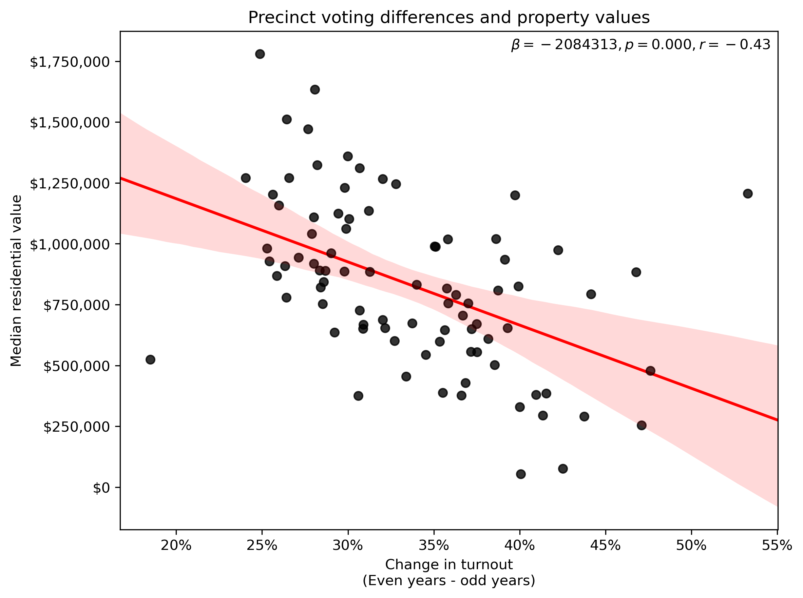
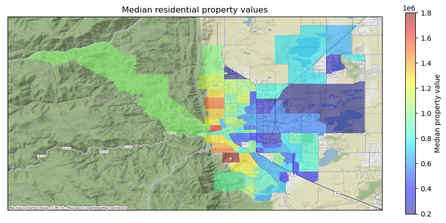

# Voter turnout patterns for Boulder

This repository contains the code and data for my [August 9 guest editorial](https://www.dailycamera.com/2022/08/09/guest-opinion-brian-keegan-odd-election-years-are-temporal-gerrymandering/) in the *Daily Camera*. 

> "I was curious who stands to lose from shifting away from odd-year elections given this venomous rhetoric. Using open data from the offices of the county clerk, assessor’s office and the state demography office, I analyzed the makeup and behavior of voters in each of the City of Boulder’s 88 precincts for every election between 2000 and 2021. I found two powerful patterns: the precincts with the highest turnout in odd election years are richer and older than precincts with lower turnout."

## Data 
I used several data sources for these analyses. First, the Boulder County Clerk publishes precinct-level [statement of votes](https://bouldercounty.gov/elections/by-year/). I used the data for the 2021 and 2020 elections. Second, data about historical turnout since 2000 and registered voter ages was derived from the [Master Voting History data](https://bouldercounty.gov/elections/maps-and-data/data-access/#Registered-Voter-Data) published by the County Clerk's office. Third, I used the [voting district shapefile](https://opendata-bouldercounty.hub.arcgis.com/datasets/precincts/explore) published by Boulder County to define the boundaries of precincts. Fourth, I used [parcel shapefiles](https://opendata-bouldercounty.hub.arcgis.com/datasets/parcels) and [property assessment](https://bouldercounty.gov/property-and-land/assessor/data-download/) data from the County Assessor's office to perform a [spatial join](https://en.wikipedia.org/wiki/Spatial_join) and compute median assessed home prices per precinct.

The step-by-step analyses for loading, cleaning, aligning, analyzing, and visualizes these data can be reviewed in the `Analysis.ipynb` Jupyter Notebook file. This code also makes use of these other libraries, which I'd strongly recommend a package manager like [Anaconda](https://www.anaconda.com/products/individual) for managing.

* [Jupyter Notebook](https://jupyter.org/)
* [Pandas](https://pandas.pydata.org/)
* [Numpy](https://numpy.org/)
* [Matplotlib](https://matplotlib.org/)
* [Seaborn](https://seaborn.pydata.org/)
* [Geopandas](https://geopandas.org/en/stable/)
* [PyProj](https://pyproj4.github.io/pyproj/stable/)
* [Geoplot](https://residentmario.github.io/geoplot/index.html)

## Findings

### Turnout
> "The citizens of Boulder should be proud that turnout (total votes divided by registered voters) is much higher than the rest of Colorado and the country: 89.1% in the 2020 election (an “even” year). But in the 2021 election (an “odd” year) only 47.9% of eligible voters cast ballots. One cannot ignore this significant drop-off in turnout between even and odd years and its implications for the legitimacy of decisions being made."

 

The x-axis is year and the y-axis is percent of registered voters who cast a ballot. There is a strong pattern of odd-year elections have significantly lower voter turnout than even-year elections.

This is a pair of choropleths of the voting districts in the City of Boulder colored by their average turnout in even-year (top) and odd-year (bottom) elections overlaid on a map of topography and roads. Redder colors indicate greater turnout and bluer colors indicate lower turnout.

### Drop-off
> "I naively thought that this turnout drop-off between even and odd election years would be relatively consistent across precincts. It is not. The “851” precinct northwest of Tantra Park only has the lowest average drop-off in turnout (18%) from even to odd years: these citizens vote relatively consistently across odd and even years. In contrast, the “834” precinct encompassing CU’s East Campus has the highest average drop-off in turnout (62%): These citizens vote much less in odd years than even years. The average drop-off across precincts was 34.9%, which is similar to the 35% drop-off for precinct “831” encompassing the Hill neighborhood west of CU’s main campus. It’s not just college students ignoring odd-year elections."

This is a single choropleth of the voting districts in the City of Boulder colored by the difference between their average even and odd year turnouts overlaid on a map of topography and roads. Redder colors indicate a greater difference between even and odd-year election turnout and bluer colors indicate a smaller difference between even and odd-year election turnout.

### Property values
> "Are there patterns behind this variance in even-to-odd year turnout drop-off? Using data from the county assessor’s office, I analyzed the median assessed value for residential properties in each precinct and found a strong negative correlation of -0.43: Precincts with more valuable homes have smaller drop-offs in turnout between even and odd years than precincts with less valuable homes."

  

A scatterplot with the change in turnout between even and odd years on the x-axis and the median assessed property value on the y-axis. A best fit line in red with 95% confidence intervals for its slope in light red.

  

This is a single choropleth of the voting districts in the City of Boulder colored by the median residential property value in 2021 overlaid on a map of topography and roads. Redder colors indicate more valuable properties and bluer colors indicate less valuable properties.

### Age
> "The county clerk’s public voter file records each registrant’s year of birth. An even stronger negative pattern (r=-0.84) plays out here: Precincts with older voters have smaller drop-offs in turnout between even and odd elections. Wealthy and older voters vote in odd-year elections when few others are voting."

  

A scatterplot with the change in turnout between even and odd years on the x-axis and the average age of voters on the y-axis. A best fit line in red with 95% confidence intervals for its slope in light red.

  

This is a single choropleth of the voting districts in the City of Boulder colored by the average age of registered voters in 2021 overlaid on a map of topography and roads. Redder colors indicate older voters and bluer colors indicate younger voters.

  

A paired bar plot with the average turnout per precinct by age buckets on the x-axis (18-24, 25-34, 35-44, 45-54, 55-64, 65+) and turnout values for odd-year elections (blue bars) and even-year elections (orange bars). Black lines are the 95% confidence interval across precinct-years.

> "The over-65 demographic only made up 10% of the population in 2010 but is estimated to overtake the declining 0-17 population in 2023 and could make up 21% of the population in 2030. The rapid greying of Boulder and the power that odd-year elections give to these voters is a relationship that cannot be ignored."

  

The x-axis is time from 2000 through 2030. The y-axis is the percent of the population. There are colored lines corresponding to different age buckets (0-17 in blue, 18-24 in orange, 25-34 in green, 35-44 in red, 45-54 in purple, 55-64 in brown, 65+ in pink).

### Regression
> "Using only these two variables (age and home value), a simple linear regression model can explain 77.8% of the variance in the turnout drop-off across Boulder’s 88 precincts."

 

A screenshot of the regression model output predicting precinct voter drop-off as a function of voter age and property values. 
