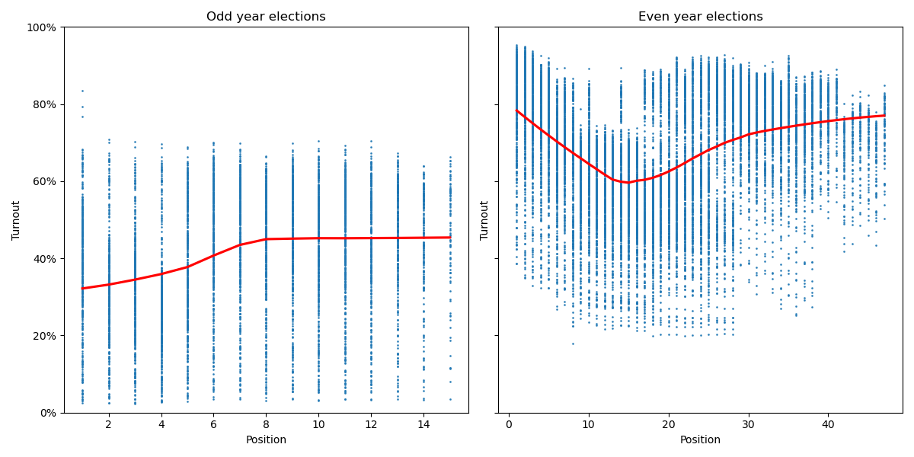
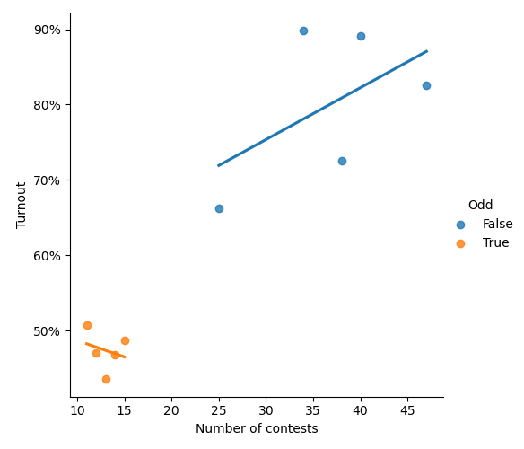
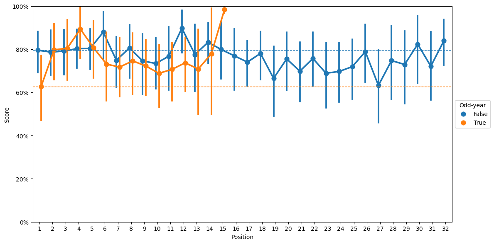

# Ballot position and contest predictability

This repository contains the code and data for the guest editorial in the October 14 of the *Daily Camera*. 

The data in `all-election-cleaned-sov.csv` is taken from the Boulder County Clerk's precinct-level [statement of votes data](https://bouldercounty.gov/elections/by-year/) for 2012 to 2021.

The step-by-step analyses can be reviewed in the `Ballot_position.ipynb` file.

## Findings
### Turnout by position
  
The x-axis is the contest's position on the ballot (1=first), the y-axis it the turnout for that contest as measured by total votes summed across choices divided by active voters in the precinct. The colored lines correspond to each election between 2012 and 2021. The circle is the average value and the lines above and below the circle are the 95% confidence interval.

  
Two side-by-side plots (left is odd, right is even), the x-axis is ballot position, the y-axis is turnout. Each blue point is the turnout for a single precinct in a single year. The red line is a smoothed (LOESS) best-fit line.

### Turnout by contest count
  
The x-axis is the number of contests in an election, the y-axis is the maximum turnout across all contests in the election. The blue points are even years and the orange points are odd years. Best-fit lines (least sum of squares) is estimated for the even and odd years and displayed in blue and orange respectively.

### Predictability by position
  
The x-axis is ballot position, y-axis is the [R2 value](https://en.wikipedia.org/wiki/Coefficient_of_determination). Blue points/lines are for even-year elections and orange points/lines are for odd-year elections. An ensemble of [gradient boosting](https://scikit-learn.org/stable/modules/generated/sklearn.ensemble.GradientBoostingRegressor.html), [LinearSVR](https://scikit-learn.org/stable/modules/generated/sklearn.svm.LinearSVR.html), [SGDRegressor](https://scikit-learn.org/stable/modules/generated/sklearn.linear_model.SGDRegressor.html), and [KNeighborsRegressor](https://scikit-learn.org/stable/modules/generated/sklearn.neighbors.KNeighborsRegressor.html) regression models are used in a five-fold cross-validation framework to estimate the winning candidate's vote share for each contest at the level of precincts.

## Dependencies
This code was collected using Python scripts in a Jupyter Notebook. It also makes use of these other libraries, which I'd strongly recommend a package manager like [Anaconda](https://www.anaconda.com/products/individual) for managing.

* [Jupyter Notebook](https://jupyter.org/)
* [Pandas](https://pandas.pydata.org/)
* [Numpy](https://numpy.org/)
* [Matplotlib](https://matplotlib.org/)
* [Seaborn](https://seaborn.pydata.org/)