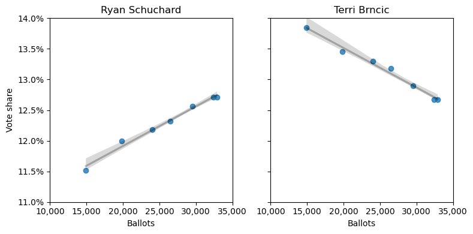
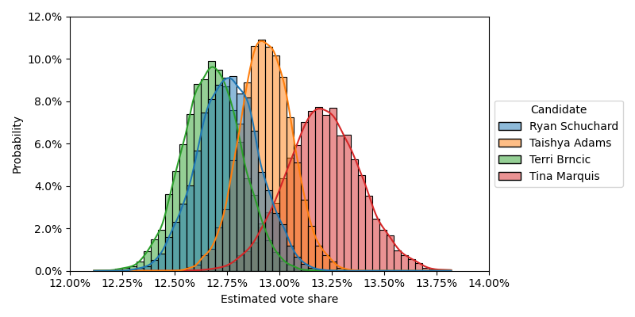
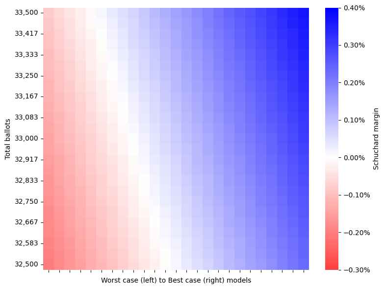

# Election 2023 forecasting
This repository contains the code and data for forecasting the vote shares of city council candidates. 

The data "boulder_election_2023.csv" records the [election updates](https://election.boco.solutions/ElectionResults2023C) from the Boulder County Clerk updated between November 7 and November 16. 

Because voters are allowed to select up to four candidates for the City Council race, the vote totals for this race are inflated compared to other races. I model city council candidates' vote shares as a function of the votes cast for the first round of the mayoral election because this is a close (but not perfect) proxy for the total number of ballots cast.

## Findings
### Vote share as a function of ballots
Some candidates' vote shares decrease as more ballots come in: ballots counted earlier favored them but ballots counted later did not. Other candidates vote shares increase as more ballots come in: later ballots favored them more than early ballots. 

These patterns have a remarkably strong linear relationship: Schuchard's vote share increased as more ballots were counted while Brncic's vote share decreased as more ballots were counted. The grey lines capture the best-fit linear regression model estimates for this relationship. Extrapolating the model forward to the final number of (mayoral) ballots cast should give an estimate of the candidates' vote shares.

### Close races
The regression model estimates include standard errors on the slope and intercept parameters. Sampling from a normal distribution around these estimates can illustrate the probabilities of different vote share outcomes from the model. Schuchard beats Brncic 65% of the time across these model runs.

### Grid search
We can use the standard errors around the estimates to extrapolate worst case to best case models by assuming that the regression models' slopes for Scuchard and Brncic are inversely related with each other. In a best case scenario, if Schuchard's slope goes up, Brncic's slope goes down a similar amount. In a worst case scenario, if Schchard's slope goes down, Brncic's slope goes up a similar amount.

Perform a grid search over the worst case to best case model scenarios and different amounts of voter turnout. The heatmap visualizes Schuchard's advantage over Brncic across a range of model estimates and turnout scenarios. Schuchard wins in 67% of these scenarios.

### Model performance
This table summarizes the performance of the model. The "Predicted" column is the model's estimated vote share for each candidate assuming 32,893 ballots. "Actual" is the observed vote share for each candidate in the November 16, 2023 report. "Difference" is the gap between the Predicted and Actual vote shares.

|                | Predicted | Actual | Difference |
|:--------------:|:---------:|:------:|:----------:|
|   Tara Winer   | 18.80%    | 18.75% | 0.05%      |
|  Tina Marquis  | 13.22%    | 13.19% | 0.02%      |
|  Taishya Adams | 12.93%    | 12.91% | 0.02%      |
| Ryan Schuchard | 12.75%    | 12.71% | 0.04%      |
|  Terri Brncic  | 12.68%    | 12.67% | 0.01%      |
|  Jenny Robins  | 9.87%     | 9.92%  | -0.05%     |
|  Waylon Lewis  | 7.83%     | 7.82%  | 0.01%      |
|  Silas Atkins  | 5.98%     | 6.02%  | -0.04%     |
|   Aaron Neyer  | 3.05%     | 3.07%  | -0.02%     |
| Jacques Decalo | 2.91%     | 2.94%  | -0.03%     |
